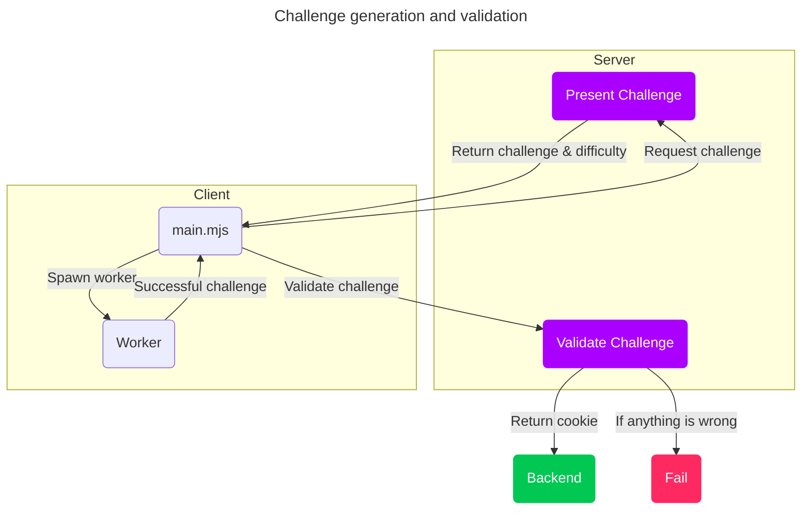
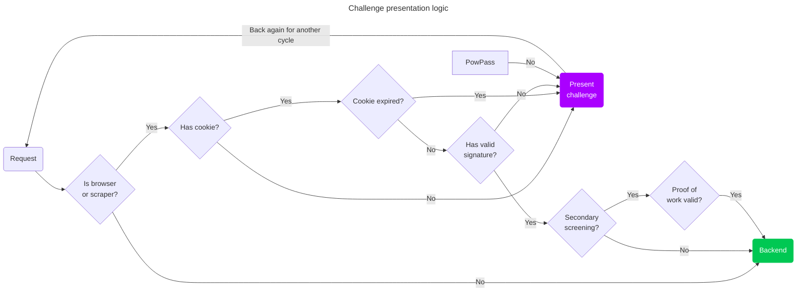

# Anubis

<center>

</center>


Anubis [weighs the soul of your connection](https://en.wikipedia.org/wiki/Weighing_of_souls) using a sha256 proof-of-work challenge in order to protect upstream resources from scraper bots.

Installing and using this will likely result in your website not being indexed by Google or other search engines. This is considered a feature of Anubis, not a bug.

This is a bit of a nuclear response, but AI scraper bots scraping so aggressively have forced my hand. I hate that I have to do this, but this is what we get for the modern Internet because bots don't conform to standards like robots.txt, even when they claim to.

In most cases, you should not need this and can probably get by using Cloudflare to protect a given origin. However, for circumstances where you can't or won't use Cloudflare, Anubis is there for you.

If you want to try this out, connect to [git.xeserv.us](https://git.xeserv.us).

## Support

If you run into any issues running Anubis, please [open an issue](https://github.com/Xe/x/issues/new?template=Blank+issue) and tag it with the Anubis tag. Please include all the information I would need to diagnose your issue.

For live chat, please join the [Patreon](https://patreon.com/cadey) and ask in the Patron discord in the channel `#anubis`.

## How Anubis works

Anubis uses a proof-of-work challenge to ensure that clients are using a modern browser and are able to calculate SHA-256 checksums. Anubis has a customizable difficulty for this proof-of-work challenge, but defaults to 5 leading zeroes.



### Challenge presentation

Anubis decides to present a challenge using this logic:

- User-Agent contains `"Mozilla"`
- Request path is not in `/.well-known`, `/robots.txt`, or `/favicon.ico`
- Request path is not obviously an RSS feed (ends with `.rss`, `.xml`, or `.atom`)

This should ensure that git clients, RSS readers, and other low-harm clients can get through without issue, but high-risk clients such as browsers and AI scraper bots will get blocked.



### Proof of passing challenges

When a client passes a challenge, Anubis sets an HTTP cookie named `"within.website-x-cmd-anubis-auth"` containing a signed [JWT](https://jwt.io/) (JSON Web Token). This JWT contains the following claims:

- `challenge`: The challenge string derived from user request metadata
- `nonce`: The nonce / iteration number used to generate the passing response
- `response`: The hash that passed Anubis' checks
- `iat`: When the token was issued
- `nbf`: One minute prior to when the token was issued
- `exp`: The token's expiry week after the token was issued

This ensures that the token has enough metadata to prove that the token is valid (due to the token's signature), but also so that the server can independently prove the token is valid. This cookie is allowed to be set without triggering an EU cookie banner notification; but depending on facts and circumstances, you may wish to disclose this to your users.

### Challenge format

Challenges are formed by taking some user request metadata and using that to generate a SHA-256 checksum. The following request headers are used:

- `Accept-Encoding`: The content encodings that the requestor supports, such as gzip.
- `Accept-Language`: The language that the requestor would prefer the server respond in, such as English.
- `X-Real-Ip`: The IP address of the requestor, as set by a reverse proxy server.
- `User-Agent`: The user agent string of the requestor.
- The current time in UTC rounded to the nearest week.
- The fingerprint (checksum) of Anubis' private ED25519 key.

This forms a fingerprint of the requestor using metadata that any requestor already is sending. It also uses time as an input, which is known to both the server and requestor due to the nature of linear timelines. Depending on facts and circumstances, you may wish to disclose this to your users.

### JWT signing

Anubis uses an ed25519 keypair to sign the JWTs issued when challenges are passed. Anubis will generate a new ed25519 keypair every time it starts. At this time, there is no way to share this keypair between instance of Anubis, but that will be addressed in future versions.

## Setting up Anubis

Anubis is meant to sit between your reverse proxy (such as Nginx or Caddy) and your target service. One instance of Anubis must be used per service you are protecting.

Anubis is shipped in the Docker image [`ghcr.io/xe/x/anubis:latest`](https://github.com/Xe/x/pkgs/container/x%2Fanubis). Other methods to install Anubis may exist, but the Docker image is currently the only supported method.

The Docker image runs Anubis as user ID 1000 and group ID 1000. If you are mounting external volumes into Anubis' container, please be sure they are owned by or writable to this user/group.

Anubis has very minimal system requirements. I suspect that 128Mi of ram may be sufficient for a large number of concurrent clients. Anubis may be a poor fit for apps that use WebSockets and maintain open connections, but I don't have enough real-world experience to know one way or another.

Anubis uses these environment variables for configuration:

| Environment Variable | Default value           | Explanation                                                                                                                                                                                                                                                                              |
| :------------------- | :---------------------- | :--------------------------------------------------------------------------------------------------------------------------------------------------------------------------------------------------------------------------------------------------------------------------------------- |
| `BIND`               | `:8923`                 | The TCP port that Anubis listens on.                                                                                                                                                                                                                                                     |
| `DIFFICULTY`         | `5`                     | The difficulty of the challenge, or the number of leading zeroes that must be in successful responses.                                                                                                                                                                                   |
| `METRICS_BIND`       | `:9090`                 | The TCP port that Anubis serves Prometheus metrics on.                                                                                                                                                                                                                                   |
| `SERVE_ROBOTS_TXT`   | `false`                 | If set `true`, Anubis will serve a default `robots.txt` file that disallows all known AI scrapers by name and then additionally disallows every scraper. This is useful if facts and circumstances make it difficult to change the underlying service to serve such a `robots.txt` file. |
| `TARGET`             | `http://localhost:3923` | The URL of the service that Anubis should forward valid requests to.                                                                                                                                                                                                                     |

### Docker compose

Add Anubis to your compose file pointed at your service:

```yaml
services:
  anubis-nginx:
    image: ghcr.io/xe/x/anubis:latest
    environment:
      BIND: ":8080"
      DIFFICULTY: "5"
      METRICS_BIND: ":9090"
      SERVE_ROBOTS_TXT: "true"
      TARGET: "http://nginx"
    ports:
      - 8080:8080
  nginx:
    image: nginx
    volumes:
      - "./www:/usr/share/nginx/html"
```

### Kubernetes

This example makes the following assumptions:

- Your target service is listening on TCP port `5000`.
- Anubis will be listening on port `8080`.

Attach Anubis to your Deployment:

```yaml
containers:
  # ...
  - name: anubis
    image: ghcr.io/xe/x/anubis:latest
    imagePullPolicy: Always
    env:
      - name: "BIND"
        value: ":8080"
      - name: "DIFFICULTY"
        value: "5"
      - name: "METRICS_BIND"
        value: ":9090"
      - name: "SERVE_ROBOTS_TXT"
        value: "true"
      - name: "TARGET"
        value: "http://localhost:5000"
    resources:
      limits:
        cpu: 500m
        memory: 128Mi
      requests:
        cpu: 250m
        memory: 128Mi
    securityContext:
      runAsUser: 1000
      runAsGroup: 1000
      runAsNonRoot: true
      allowPrivilegeEscalation: false
      capabilities:
        drop:
          - ALL
      seccompProfile:
        type: RuntimeDefault
```

Then add a Service entry for Anubis:

```diff
# ...
 spec:
   ports:
+  - protocol: TCP
+    port: 8080
+    targetPort: 8080
+    name: anubis
```

Then point your Ingress to the Anubis port:

```diff
   rules:
   - host: git.xeserv.us
     http:
       paths:
       - pathType: Prefix
         path: "/"
         backend:
           service:
             name: git
             port:
-              name: http
+              name: anubis
```

## Known caveats

Anubis works with most programs without any issues as long as they're configured to trust `127.0.0.0/8` and `::1/128` as "valid proxy servers". Some combinations of reverse proxy and target application can have issues. This section documents them so that you can pattern-match and fix them.

### Caddy + Gitea/Forgejo

Gitea/Forgejo relies on the reverse proxy setting the `X-Real-Ip` header. Caddy does not do this out of the gate. Modify your Caddyfile like this:

```diff
 ellenjoe.int.within.lgbt {
   # ...
-  reverse_proxy http://localhost:3000
+  reverse_proxy http://localhost:3000 {
+    header_up X-Real-Ip {remote_host}
+  }
   # ...
 }
```

Ensure that Gitea/Forgejo have `[security].REVERSE_PROXY_TRUSTED_PROXIES` set to the IP ranges that Anubis will appear from. Typically this is sufficient:

```ini
[security]
REVERSE_PROXY_TRUSTED_PROXIES = 127.0.0.0/8,::1/128
```

However if you are running Anubis in a separate Pod/Deployment in Kubernetes, you may have to adjust this to the IP range of the Pod space in your Container Networking Interface plugin:

```ini
[security]
REVERSE_PROXY_TRUSTED_PROXIES = 10.192.0.0/12
```
