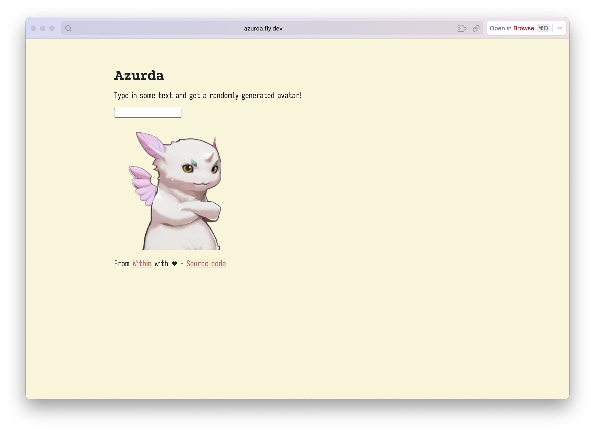

# Azurda

Azurda is a horrible crime that enables fall-through caching with Tigris.

The general idea of fall-through caching is really simple. We use the bucket as a cache because those are expensive to generate, and potentially infinite. If the object already exists in the cache then serve it directly. If not, then generate it and return it for Tigris to store and then serve to the user.

The heinous crime that we're doing here is implementing this using Tigris' shadow bucket feature. Normally a shadow bucket allows you to set up a Tigris bucket that mirrors an existing bucket but only moves over files on request. This is useful when you're migrating from one storage provider to another so you don't have to do the big upload of everything.

However this realistically supports anything that support that can implement the S3 GetObject API call. It doesn't even have to be a storage service. You can just make your own server implement this call and then you get everything cached in tigris for you.

This works because we're treating Stable Diffusion as a key-value store, where the key is the fabricated prompt based on the MD5 checksum passed in the URL and the value is the generated image from Stable Diffusion.

I can't believe this works.

The main downside of this approach is that I haven't implemented authentication yet. So if you know the URL you can generate images. This is fine for my use case but you might want to add some kind of authentication if you're going to use this in production. Implementing authentication is therefore trivial and thus an exercise for the reader.

This code is free as in mattress. Do whatever you want with it. I don't care. I'm not your parent.
