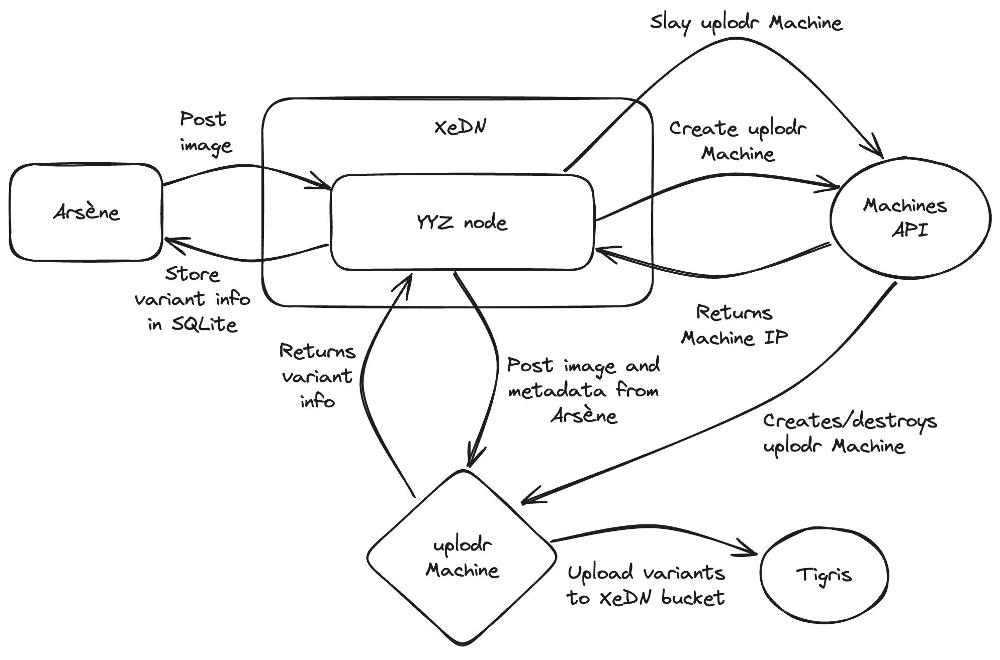

# Making image conversion easier for XeDN with Fly Machines

Image conversion is a surprisingly expensive process. It's one of those rare problems in computer science that is both memory and CPU intensive. Recently I added "dynamic" file uploads to XeDN so that [Arsène](https://arsene.fly.dev) (an art project that generates cryptocurrency horoscopes every 12 hours) could generate article-specific cover art. This gives each article illustrations like this:


However, soon after I added dynamic file uploads, I got emails that my XeDN nodes were randomly crashing once every 12 hours. When I wrote Arsène, I made it generate a new article every 12 hours. I shrugged off the issue because I told Arsène to generate a new article at _midnight_, but when I was looking at the XeDN logs at 19:00 for some reason, I saw one of the Machines run out of memory and then I got one of those familiar "your app ran out of memory and crashed" emails. 19:00 local is UTC midnight.

I needed more memory for XeDN's image conversion process, but I didn't need that memory all of the time. Currently each of the 35 XeDN nodes use 512 MB of memory each. I don't feel a need to increase that amount further because that feels wasteful for me. I don't want to pay for memory that I don't need across the fleet, it'll only be needed once every 12 hours for a few minutes at most. I also don't want to pay for a dedicated machine that is always on, because that's also kinda wasteful. I want to pay for what I use, and I want to use as little as possible.

How can I spin up compute when I need it and then spin it down when I don't?

## Compute on-demand

Turns out [Fly.io](https://fly.io) lets you do this with the [Machines API](https://fly.io/docs/machines/working-with-machines/). All it would take is moving the image conversion process to its own program that gets started up in a Machine and then gets destroyed when it's done.

So I made uplodr, a little service that receives images over [gRPC](https://grpc.io), converts them to webp, avif, jpeg, and makes a smaller png thumbnail, and then uploads them to [Tigris](https://www.tigrisdata.com/). It has one purpose in life: converting images to other formats and returning the URLs of the converted images.

Here's the protobuf service definition for uplodr:

```protobuf
service Image {
  rpc Ping(Echo) returns (Echo);
  rpc Upload(UploadReq) returns (UploadResp);
}
```

The `UploadReq` message is just a container for the image bytes and some limited metadata:

```protobuf
message UploadReq {
  string file_name = 1;
  bytes data = 2;
  string folder = 3;
}
```

And the `UploadResp` message just has a slice of `Variant` messages that include the mime type of the image and the public URL:

```protobuf
message UploadResp {
  repeated Variant variants = 1;
}

message Variant {
  string url = 1;
  string mime_type = 2;
}
```

The flow looks roughly like this:



The Machine is created with this request:

```go
m, err := iu.fmc.CreateMachine(ctx, *flyAppName, flymachines.CreateMachine{
    Name:   "uplodr-" + uuid.New().String(),
    Region: *flyRegion,
    Config: flymachines.MachineConfig{
        Guest: flymachines.MachineGuest{
            CPUKind:  "performance",
            CPUs:     16,
            MemoryMB: 8192 * 4, // 32 GB
        },
        Image: "registry.fly.io/xedn",
        Processes: []flymachines.MachineProcess{
            {
                Cmd: []string{"/bin/uplodr", "--grpc-addr=:" + *uplodrPort, "--slog-level=debug", fmt.Sprintf("--msg-size=%d", chonkiness)},
            },
        },
        // ...
    },
})
```

This creates a Machine with 32 GB of memory and 16 CPUs. I have to get so much RAM because one of the formats I'm converting to is [AVIF](https://en.wikipedia.org/wiki/AVIF), which is very CPU-intensive. This was the only way I could get more cores, which makes conversion faster, saving compute time and bill money. Realistically I only need about 8 CPU cures, but 16 is the minimum for that machine shape.

Once the Machine is started, XeDN will then spinloop for a moment to try and create a gRPC connection to that Machine. During this time, it reads the rest of the image from the client into memory. Once the connection is established, it fires over the image, it gets converted, and the resulting objects get put into the cloud. The Machine then gets destroyed no matter what happens thanks to the `defer`red destroy call:

```go
defer func() {
    ctx, cancel := context.WithTimeout(context.Background(), 5*time.Minute)
    defer cancel()

    slog.Debug("deleting machine", "machine", m.ID)
    if err := iu.fmc.DestroyAppMachine(ctx, *flyAppName, m.ID); err != nil {
        slog.Error("cannot delete machine", "err", err, "machine", m.ID)
    }
}()
```

After I finished implementing this, it was serendipidously close to the time that Arséne would generate a new post. I decided to test my luck and deployed it to production.

It worked the first time.

I no longer need to worry about out-of memory errors with XeDN dynamic uploads. Compute spins up when I need it and spins down when I don't. I only pay for what I use.

## Improvements

Sometimes the Machine can get "lost". In order to minimize pile-up, I may need to implement an orchestration layer that would scan for abandoned uplodr Machines and destroy them. The heuristic could be as simple as "if the Machine is older than 1 hour, destroy it".

I've also made uplodr self-terminate after 20 minutes of the process being alive, XeDN spawns uplodr Machines with the restart policy of `no`, meaning that the Machine will be stopped after the process ends. This is a safety measure in case the `defer`red destroy call fails for some reason. I will still have to [pay for the filesystem](https://community.fly.io/t/we-are-going-to-start-collecting-charges-for-stopped-machines-rootfs-starting-april-25th/17825) if the Machine is abandoned for more than 30 days, but that should prevent pile-ons.

When I implemented this, I used [`github.com/cenkalti/backoff/v4`](https://pkg.go.dev/github.com/cenkalti/backoff/v4) to handle all of the exponential backoff/retry logic. This makes the code horrible to read. Something like this:

```go
pong, err := client.Ping(ctx, &pb.Echo{Nonce: id})
if err != nil {
  slog.Error("cannot ping machine", "err", err)
  http.Error(w, err.Error(), http.StatusInternalServerError)
  return
}
```

has to be written like this:

```go
pong, err := backoff.RetryWithData[*pb.Echo](func() (*pb.Echo, error) {
  return client.Ping(ctx, &pb.Echo{Nonce: id})
}, bo)
if err != nil {
  slog.Error("cannot ping machine", "err", err)
  http.Error(w, err.Error(), http.StatusInternalServerError)
  return
}
```

I may have to write my own exponential backoff package to handle this more cleanly.

This system has been deployed to production for a few months without any notable issues. The only downside is that I have to change the maximum gRPC message size based on how big the relevant images are. If I want to work around this, I'll need to use streaming, maybe something like this:

```protobuf
message UploadReq {
  string file_name = 1;
  bytes data = 2;
  string folder = 3;
  bool done = 4;
}

message UploadResp {
  repeated Variant variants = 1;
  string file_name = 2;
  string folder = 3;
}

service Image {
  rpc Ping(Echo) returns (Echo);
  rpc Upload(stream UploadReq) returns (stream UploadResp);
}
```

This would function analogously to a [Go io.Reader](https://pkg.go.dev/io#Reader) except it would be a bit different. The basic idea is that I would write "client" code that would upload 4096 byte chunks of the file to the gRPC server (dynamically created by XeDN), then the server would actually convert images when they are "done". This would probably be done in a very naiive way, blocking the whole process while it does image conversion.

I plan to implement this when I have time.
